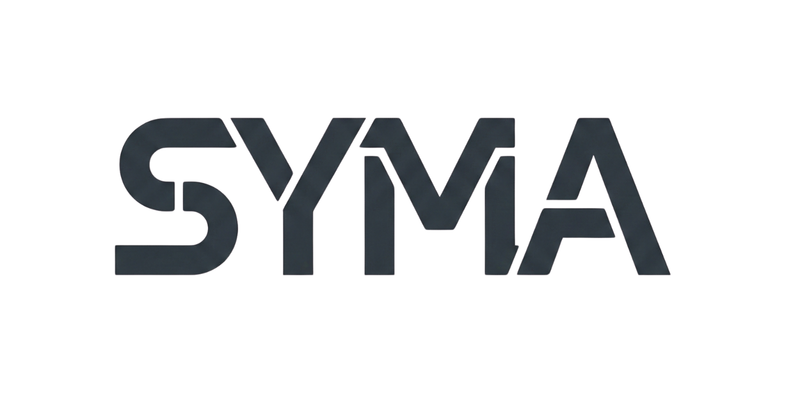

# SYMA - Sistema Modular Auto-ensamblable

<div align="center">



**Plataforma de robótica modular auto-reconfigurable para la Industria 5.0**

[](https://github.com/synthec-robotics/)
[](https://www.instagram.com/synthec.robotics/)
[](https://www.youtube.com/@synthec.robotics)

</div>

---

## 📋 Sobre el Proyecto

**SYMA (Sistema Modular Auto-ensamblable)** es una plataforma de robótica modular auto-reconfigurable (MSRR) de bajo costo desarrollada por **SYNTHEC Robotics**, un equipo de investigación del Tecnológico de Monterrey, Campus Monterrey.

El proyecto está inspirado en el diseño SMORES-EP y los microbots de Big Hero 6, con el objetivo de democratizar el acceso a tecnologías de manufactura avanzada mediante sistemas resilientes, reconfigurables y centrados en la colaboración humano-máquina.

### 🎯 Objetivos

- Desarrollar un prototipo funcional que demuestre locomoción diferencial robusta
- Implementar comunicación inalámbrica en enjambre mediante ESP-NOW
- Crear un mecanismo de acoplamiento y desacoplamiento magnético controlado
- Reducir significativamente los costos de fabricación en producción masiva

---

## 🚀 Características Principales

### ✨ Versatilidad
Capacidad de formar diferentes morfologías (serpientes, arañas, vehículos) para adaptarse a distintas tareas y entornos.

### 🛡️ Robustez
Módulos reconfigurables y reemplazables que garantizan continuidad operativa ante fallos individuales.

### 💰 Bajo Costo
Diseño modular universal replicable que reduce significativamente los costos de fabricación (~$1,250 MXN por módulo).

---

## 🛠️ Tecnologías y Especificaciones

### Hardware
- **Microcontrolador**: ESP32
- **Comunicación**: ESP-NOW (protocolo de baja latencia)
- **Locomoción**: Sistema diferencial con servomotores de rotación continua
- **Acoplamiento**: Electroimanes de retención (EPMs) controlados por puentes-H

### Software
- **Frontend**: React 18 + TypeScript
- **Build Tool**: Vite
- **Estilos**: Tailwind CSS
- **UI Components**: shadcn/ui (Radix UI)
- **Routing**: Wouter
- **Animaciones**: Framer Motion

---

## 📦 Instalación y Desarrollo

### Prerrequisitos

- Node.js 18+ y npm
- Git

### Instalación

```bash
# Clonar el repositorio
git clone https://github.com/synthec-robotics/syma.git
cd syma

# Instalar dependencias
npm install
```

### Scripts Disponibles

```bash
# Iniciar servidor de desarrollo
npm run dev

# Construir para producción
npm run build

# Previsualizar build de producción
npm run preview

# Verificar tipos TypeScript
npm run check
```

---

## 🌐 Despliegue

Este proyecto está configurado para desplegarse en **Render** como un sitio estático.

### Configuración en Render

1. Conecta tu repositorio a Render
2. Crea un nuevo **Static Site**
3. Configura:
   - **Build Command**: `npm run build`
   - **Publish Directory**: `dist`
4. Render automáticamente servirá los archivos estáticos

### Alternativas de Despliegue

- **Netlify**: Arrastra la carpeta `dist/` o conecta tu repositorio
- **Vercel**: `vercel --prod`
- **GitHub Pages**: Sube la carpeta `dist/` a la rama `gh-pages`
- **Cloudflare Pages**: Conecta tu repositorio y apunta a `dist/`

---

## 📁 Estructura del Proyecto

```
SYMA/
├── client/                 # Frontend React
│   ├── public/            # Assets estáticos
│   │   └── favicon.png
│   ├── src/
│   │   ├── assets/        # Imágenes y recursos
│   │   │   └── images/
│   │   ├── components/    # Componentes UI (shadcn/ui)
│   │   ├── hooks/         # Custom hooks
│   │   ├── lib/           # Utilidades
│   │   ├── pages/         # Páginas de la aplicación
│   │   └── index.css      # Estilos globales
│   └── index.html         # HTML principal
├── dist/                  # Build de producción (generado)
├── package.json
├── vite.config.ts
└── tailwind.config.ts
```

---

## 👥 El Equipo SYNTHEC

| Nombre | Rol |
|--------|-----|
| **Angel Moreno** | Líder del Proyecto |
| **Carlos García** | Diseñador Mecánico |
| **Susana Fang** | Especialista en Electrónica |
| **Emiliano Bustamante** | Investigador |

---

## 🎨 Características del Sitio Web

- ✅ Diseño responsive y mobile-first
- ✅ Modo claro optimizado para legibilidad
- ✅ Animaciones suaves con scroll reveal
- ✅ Efecto typewriter en el hero
- ✅ Navegación suave entre secciones
- ✅ Componentes UI accesibles (Radix UI)
- ✅ Separadores visuales entre secciones
- ✅ Imágenes del equipo y diagramas técnicos

---

## 📄 Licencia

Este proyecto está bajo la licencia MIT. Ver el archivo `LICENSE` para más detalles.

---

## 🔗 Enlaces

- **GitHub**: [github.com/synthec-robotics](https://github.com/synthec-robotics/)
- **Instagram**: [@synthec.robotics](https://www.instagram.com/synthec.robotics/)
- **YouTube**: [@synthec.robotics](https://www.youtube.com/@synthec.robotics)

---

## 📝 Notas

Este es un sitio web completamente estático. No requiere servidor backend ni base de datos. Todo el contenido es renderizado en el cliente.

---

<div align="center">

**Desarrollado con ❤️ por SYNTHEC Robotics**

_Tecnológico de Monterrey, Campus Monterrey_

© 2025 SYNTHEC Robotics. Todos los derechos reservados.

</div>

